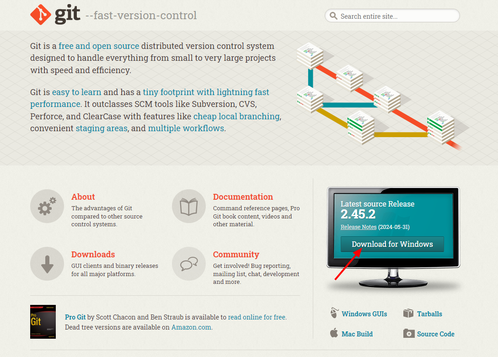
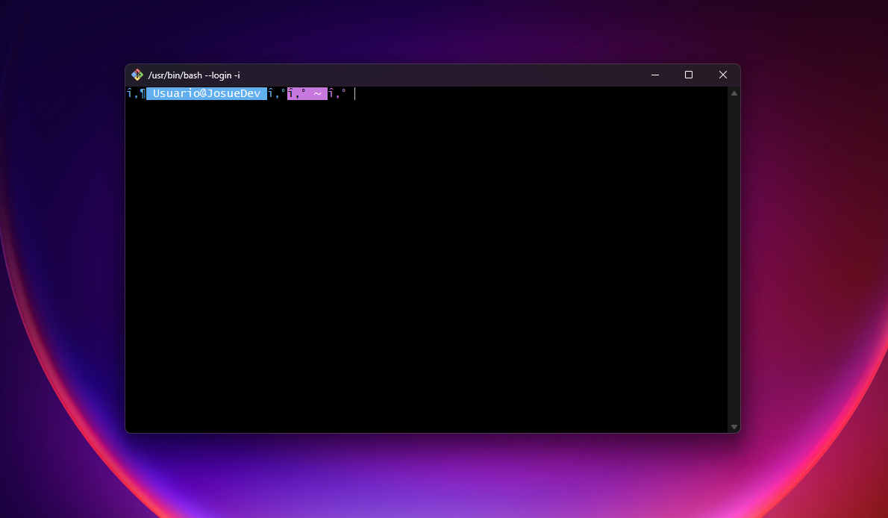
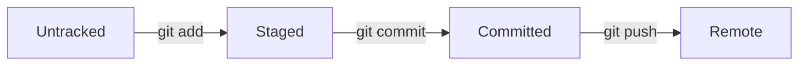
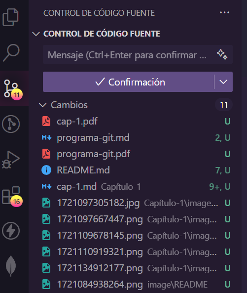
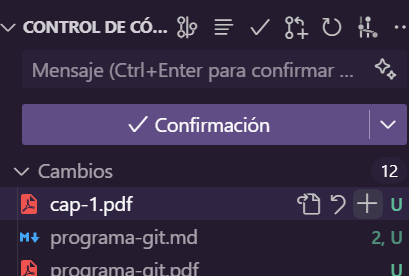

# Capítulo 1


<p style="text-align: center; font-size:12px; font-family: sans-serif; position:relative; top:-24px; font-style:italic; font-weight: 100; opacity:80%">Viajero del tiempo del código</p>

## ¿Qué es Git?

Git es un sistema de control de versiones distribuido, gratuito y de código abierto diseñado para manejar todo, desde proyectos pequeños hasta muy grandes, con velocidad y eficiencia. Para entender mejor que es un sistema de control de versiones, es necesario ver un poco de historia.

Hasta hace unos años, cuando se trabajaba en un proyecto de software, se guardaba el código en una carpeta y se iban creando copias de esta carpeta a medida que se iban haciendo cambios. Esto funcionaba bien para proyectos pequeños, pero cuando se trataba de proyectos grandes, se volvía un problema. Obviamente la situación se tornaba más caótica cuando se trabajaba en equipo, ya que cada miembro del equipo tenía su propia copia del proyecto y cuando se quería integrar los cambios de cada uno, se volvía un problema.

Es ahí cuando nacen los sistemas de control de versiones, que son herramientas que permiten llevar un registro de los cambios realizados sobre un archivo o conjunto de archivos a lo largo del tiempo, de tal manera que sea posible recuperar versiones específicas más adelante. Además, permiten trabajar en equipo de forma colaborativa, ya que permiten integrar los cambios de cada miembro del equipo de forma ordenada.

## Instalación de Git

Para instalar Git, es necesario ir a la [página oficial de Git](https://git-scm.com) y descargar el instalador correspondiente a tu sistema operativo. Una vez descargado, se debe seguir el proceso de instalación.



<p style="text-align: center; font-size:12px; font-family: sans-serif; position:relative; top:-24px; font-style:italic; font-weight: 100; opacity:80%">Página oficial de GIT</p>

Podremos comprobar que la instalación fue exitosa si vemos disponible Git Bash entre nuestros programas recien instalados o si ejecutamos el siguiente comando en la terminal:

```bash
git --version
```

_Salida esperada:_

```bash
git version 2.33.0.windows.2
```

## La terminal de comandos

Existen dos formas de interacturar con una computadora: a través de una interfaz gráfica o a través de la terminal de comandos.
La interfaz gráfica de usuario (GUI) es el conjunto de representaciones gráficas de objetos (iconos, botones, etc.) que nos permite interactuar con la computadora. Puedes considerarlo como una interfaz de apuntar y hacer clic. Por ejemplo, las carpetas representadas por íconos de carpeta en su escritorio son parte de la GUI de una computadora.

Por otro lado, la terminal de comandos, también conocida como "Command Line Interface" o por sus siglas CLI, es una interfaz de texto que nos permite interactuar con la computadora a través de comandos. En lugar de hacer clic en los íconos, escribimos comandos en la terminal para realizar tareas como mover archivos, instalar programas, etc.

En este taller, utilizaremos la terminal de comandos para interactuar con Git. Esto nos permitirá construir un modelo mental sólido de cómo funciona Git y nos dará acceso a todas sus funcionalidades. Puntualmente usaremos la termina de comandos de Git, llamada **Git Bash**.


<p style="text-align: center; font-size:12px; font-family: sans-serif; position:relative; top:-24px; font-style:italic; font-weight: 100; opacity:80%">Resultado de la búsqueda de Git Bash en los programas de Windows</p>

Una vez que hayas instalado Git, podrás abrir Git Bash y comenzar a trabajar con Git. Deberías ver una ventana similar a la siguiente:



<p style="text-align: center; font-size:12px; font-family: sans-serif; position:relative; top:-24px; font-style:italic; font-weight: 100; opacity:80%">Terminal de comandos de Git Bash</p>

<div style="background-color:black; color:white; width:70px; text-align:center;padding:4px; font-size:20px; font-family: sans-serif">Nota:</div>
Si estás utilizando un sistema operativo diferente a Windows, por ejemplo, **macOS** o **Linux**, puedes abrir la terminal de comandos de tu sistema y ejecutar los comandos de Git directamente ya que ambos sistemas operativos están basados en **Unix**.

### Desglose de la terminal de comandos

Vamos a desglosar la terminal de comandos de Git Bash para que puedas entender mejor cómo funciona. Mucho de lo que veremos acá aplicará también a la terminal de comandos de otros sistemas operativos como macOS o Linux.

Antes que nada, lo primero que debemos saber es que siempre que abramos la terminal de comandos nos encontraremos en un directorio o carpeta en particular, al que nos referiremos a partir de ahora como **directorio actual**. En la terminal de comandos, el directorio actual se representa con un **path** que indica la ubicación de la carpeta en la que nos encontramos.

Por ejemplo, si abrimos la terminal de comandos de Git Bash, veremos algo como esto:

```bash
$
```

El signo de dólar `$` es el **prompt**, que indica que la terminal está lista para recibir comandos. A continuación del prompt, veremos el **path** del directorio actual. Por ejemplo, si estamos en la carpeta de usuario, veremos algo como esto:

```bash
$ /c/Users/usuario
```

En este caso, `/c/Users/usuario` es el **path** del directorio actual, que indica que estamos en la carpeta de usuario del disco `C:`.
El **path** de un directorio se compone de una serie de carpetas separadas por barras inclinadas `/`. Cada carpeta en el **path** se llama **directorio** y la última carpeta en el **path** es el **directorio actual**.

Para navegar entre directorios en la terminal de comandos, utilizamos el comando `cd` seguido del **path** del directorio al que queremos ir. Por ejemplo, si queremos ir a la carpeta de documentos, podemos escribir:

```bash
$ cd Documents
```

Y si queremos ir a la carpeta de usuario, podemos escribir:

```bash
$ cd ..
```

El comando `cd ..` nos permite retroceder un nivel en la jerarquía de directorios. Si queremos ver el contenido de un directorio, podemos utilizar el comando `ls`. Por ejemplo, si queremos ver el contenido de la carpeta de usuario, podemos escribir:

```bash
$ ls
```

Y si queremos ver el contenido de la carpeta de documentos, podemos escribir:

```bash
$ ls Documents
```

Estos son solo algunos de los comandos básicos que utilizaremos en la terminal de comandos de Git Bash. A medida que avancemos en el taller, iremos viendo más comandos y funcionalidades de Git.

### Comandos básicos de la terminal

Vamos a abrir la terminal de comandos que quieras usar, dependiendo si estás en Windows, Mac o Linux. A continuación, vamos a ver algunos comandos básicos que nos permitirán movernos por el sistema de archivos y realizar algunas operaciones básicas.

- `pwd`: Nos permite ver el directorio en el que nos encontramos.
- `ls`: Nos permite ver el contenido del directorio en el que nos encontramos.
- `cd`: Nos permite cambiar de directorio.
- `mkdir`: Nos permite crear un directorio.
- `touch`: Nos permite crear un archivo.
- `rm`: Nos permite eliminar un archivo.
- `rmdir`: Nos permite eliminar un directorio.
- `mv`: Nos permite mover un archivo o directorio.
- `cp`: Nos permite copiar un archivo o directorio.
- `clear`: Nos permite limpiar la terminal.
- `cat`: Nos permite ver el contenido de un archivo.
- `echo`: Nos permite escribir en un archivo.
- `man`: Nos permite ver el manual de un comando.
- `exit`: Nos permite salir de la terminal.
- `history`: Nos permite ver el historial de comandos.

A medida que vayamos avanzando en el taller, iremos viendo los usos y utilidades de cada uno de estos comandos con ejemplos prácticos.

### Configuración de Git

Antes de empezar a trabajar con Git, es necesario configurar nuestro nombre de usuario y correo electrónico. Esto es necesario para que Git pueda identificar quién es el autor de los cambios que se hagan en el proyecto. Para configurar nuestro nombre de usuario y correo electrónico, debemos ejecutar los siguientes comandos en la terminal:

```bash
git config --global user.name "Tu nombre"
git config --global user.email "email@email.com"
```

De esta forma, cada acción que realicemos en el repositorio, quedará registrada con nuestro nombre y correo electrónico.

## Repositorios locales

Los repositorios locales son aquellos que se encuentran en nuestra máquina. En estos repositorios es donde se trabaja en el código de un proyecto. A continuación, vamos a ver cómo podemos crear un repositorio local, cómo podemos hacer cambios en el código y cómo podemos guardar estos cambios en el repositorio.

### Crear un repositorio local

Para crear un repositorio local, es necesario ir a una ubicación en la que querramos guardar nuestro proyecto. Antes que nada, vamos a crear una nueva carpeta en la que guardaremos nuestro proyecto. Para ello, vamos a abrir la terminal de comandos y vamos a ejecutar el siguiente comando:

```bash
mkdir 01-hello-git
```

Este comando creará una nueva carpeta llamada "01-hello-git". Ahora, vamos a movernos a esta carpeta con el siguiente comando:

```bash
cd 01-hello-git
```

Una vez que estemos en la carpeta, vamos a inicializar un repositorio de Git con el siguiente comando:

```bash
git init
```

Este comando inicializa un repositorio de Git en la carpeta en la que nos encontramos. Ahora, si ejecutamos el comando `ls`, veremos que se ha creado una carpeta oculta llamada ".git". Esta carpeta es la que contiene toda la información del repositorio. Además, veremos que la terminal nos mostrará el nombre de la rama en la que nos encontramos, que por defecto es "master". Esto se debe a que una inicialización de Git crea una rama por defecto llamada "master", de allí crearemos nuevas ramas para trabajar en nuestro proyecto.

<div style="background-color:black; color:white; width:70px; text-align:center;padding:4px; font-size:20px; font-family: sans-serif">Nota:</div>
Si queremos ver los archivos ocultos en la terminal, podemos ejecutar el comando `ls -a`. También podemos ver los archivos ocultos en el explorador de archivos si habilitamos la opción de "Mostrar archivos ocultos".

### Hacer cambios en el código

Ahora que ya tenemos un repositorio local, vamos a hacer cambios en el código. Para ello, vamos a crear un archivo llamado "README.md" en la carpeta del proyecto. Para crear este archivo, vamos a ejecutar el siguiente comando:

```bash
touch README.md
```

Los archivos con extensión ".md" son archivos de texto que se utilizan para escribir documentación. En este caso, vamos a utilizar el archivo "README.md" para escribir la documentación del proyecto. Una vez que hayamos creado el archivo, vamos a abrirlo con un editor de texto, en este caso VSCode.

Podemos abrir todo el contenido de la carpeta `01-hello-git` en VSCode con el siguiente comando:

```bash
code .
```

Una vez que hayamos abierto el archivo "README.md", vamos a escribir el siguiente contenido:

```markdown
# Taller de GIT

## Profesor:

- [Josue Oroya](https://github.com/joshuacba08)

## Alumno:

- [Tu nombre](Link a tu perfil de GitHub)
```

Una vez que hayamos escrito el contenido, vamos a guardar el archivo y vamos a cerrar el editor de texto. Ahora que hemos hecho cambios en el código, vamos a ver cómo podemos guardar estos cambios en el repositorio.

### Guardar cambios en el repositorio

Para guardar los cambios en el repositorio, es necesario seguir los siguientes pasos:

1. Añadir los archivos al área de preparación.
2. Hacer un commit con los cambios.
3. Ver el historial de commits.
4. Ver el estado del repositorio.

#### Añadir los archivos al área de preparación

El área de preparación es un espacio en el que se guardan los cambios que se quieren guardar en el repositorio. Para añadir los archivos al área de preparación, es necesario ejecutar el siguiente comando:

```bash
git add README.md
```

Este comando añade el archivo "README.md" al área de preparación. Si queremos añadir todos los archivos al área de preparación, podemos ejecutar el siguiente comando:

```bash
git add .
```

#### Hacer un commit con los cambios

Un commit es una operación que guarda los cambios que se han hecho en el repositorio. Para hacer un commit con los cambios, es necesario ejecutar el siguiente comando:

```bash
git commit -m "Añadir archivo README.md"
```

Este comando hace un commit con los cambios que se han añadido al área de preparación. El mensaje que se añade con la opción `-m` es un mensaje que describe los cambios que se han hecho en el commit. Es importante que este mensaje sea descriptivo, ya que nos permitirá saber qué cambios se han hecho en el proyecto.

A continuación, veremos un diagrama que muestra cómo se guardan los cambios en un repositorio de Git.


#### Ver el historial de commits

El historial de commits es una lista de todos los commits que se han hecho en el repositorio. Para ver el historial de commits, es necesario ejecutar el siguiente comando:

```bash
git log
```

Este comando muestra una lista de todos los commits que se han hecho en el repositorio. Cada commit tiene un identificador único, un autor, una fecha y un mensaje que describe los cambios que se han hecho en el commit.

#### Ver el estado del repositorio

El estado del repositorio es una lista de los archivos que se han modificado, añadido o eliminado en el repositorio. Para ver el estado del repositorio, es necesario ejecutar el siguiente comando:

```bash
git status
```

Este comando muestra una lista de los archivos que se han modificado, añadido o eliminado en el repositorio. Además, muestra si los archivos han sido añadidos al área de preparación o no.

### Actividad

1. Crear un repositorio local en una carpeta llamada "01-hello-git".
2. Crear un archivo llamado "README.md" con el siguiente contenido:

```markdown
# Taller de GIT

## Profesor:

- [Josue Oroya](https://github.com/joshuacba08)

## Alumno:

- [Tu nombre](Link a tu perfil de GitHub)
```

3. Añadir el archivo "README.md" al área de preparación.
4. Hacer un commit con los cambios.
5. Ver el historial de commits.

## Ciclo de vida de un archivo

En Git, los archivos pasan por diferentes estados a lo largo de su vida en el repositorio. Estos estados son:

1. **Untracked**: Los archivos que no están siendo seguidos por Git. Estos archivos no han sido añadidos al repositorio y Git no está al tanto de ellos.
2. **Unmodified**: Los archivos que no han sido modificados desde el último commit. Estos archivos están en el estado en el que fueron guardados en el último commit.
3. **Modified**: Los archivos que han sido modificados desde el último commit. Estos archivos han sido cambiados y Git está al tanto de estos cambios.
4. **Staged**: Los archivos que han sido añadidos al área de preparación. Estos archivos están listos para ser guardados en el repositorio en el próximo commit.
5. **Committed**: Los archivos que han sido guardados en el repositorio. Estos archivos están en el estado en el que fueron guardados en el último commit.
6. **Ignored**: Los archivos que han sido ignorados por Git. Estos archivos no serán seguidos por Git y no serán añadidos al repositorio.
7. **Deleted**: Los archivos que han sido eliminados del repositorio. Estos archivos ya no están en el repositorio y Git no está al tanto de ellos.
8. **Renamed**: Los archivos que han sido renombrados en el repositorio. Estos archivos han cambiado de nombre y Git está al tanto de este cambio.
9. **Conflicted**: Los archivos que han entrado en conflicto durante una operación de merge. Estos archivos tienen cambios que no pueden ser resueltos automáticamente y deben ser resueltos manualmente.
10. **Unmerged**: Los archivos que han entrado en conflicto durante una operación de merge. Estos archivos tienen cambios que no pueden ser resueltos automáticamente y deben ser resueltos manualmente.

A continuación, veremos un diagrama que muestra el ciclo de vida de un archivo en Git y los comandos que se utilizan para mover un archivo entre los diferentes estados.



En el diagrama, vemos que un archivo que está en el estado "Untracked" puede ser movido al estado "Staged" con el comando `git add`. Una vez que el archivo está en el estado "Staged", puede ser movido al estado "Committed" con el comando `git commit`. Una vez que el archivo está en el estado "Committed", puede ser movido al repositorio remoto con el comando `git push` que vermos más adelante.

## Git en Visual Studio Code

Visual Studio Code es un editor de código fuente desarrollado por Microsoft que es compatible con Git. Esto significa que podemos utilizar Git directamente desde Visual Studio Code para hacer cambios en el código, hacer commits, ver el historial de commits, etc. sin necesidad de utilizar la terminal de comandos.

Para este taller, era necesario instalar Visual Studio Code, si no lo has hecho, puedes descargarlo desde la [página oficial de Visual Studio Code](https://code.visualstudio.com/). Una vez que hayas instalado Visual Studio Code, puedes abrir la carpeta del proyecto en Visual Studio Code con el siguiente comando:

`Path: $ docuemnts/01-hello-git`

```bash
code .
```

Este comando abrirá Visual Studio Code y mostrará el contenido de la carpeta del proyecto. Desde Visual Studio Code, puedes hacer cambios en el código, añadir archivos al área de preparación, hacer commits, ver el historial de commits, etc. sin necesidad de utilizar la terminal de comandos.

A continuación, veremos cómo podemos hacer un commit desde Visual Studio Code.

### Hacer un commit desde Visual Studio Code

Para hacer un commit desde Visual Studio Code, es necesario seguir los siguientes pasos:

1. Hacer cambios en el código.
2. Añadir los archivos al área de preparación.
   

<p style="text-align: center; font-size:12px; font-family: sans-serif; position:relative; top:-24px; font-style:italic; font-weight: 100; opacity:80%">Hacer clic en el tercer ícono de la barra lateral izquierda</p>

En la barra lateral izquierda, haremos clic en el tercer ícono que representa el control de versiones. Esto abrirá la vista de control de versiones en la que podremos ver los archivos que han sido modificados, añadidos o eliminados en el repositorio. Para añadir los archivos al área de preparación, haremos clic en el botón "+" que se encuentra al lado del nombre de cada archico modificado.



<p style="text-align: center; font-size:12px; font-family: sans-serif; position:relative; top:-24px; font-style:italic; font-weight: 100; opacity:80%">El botón [+] añade el archivo al estado "Staged"</p>

3. Hacer un commit con los cambios.

   

   <p style="text-align: center; font-size:12px; font-family: sans-serif; position:relative; top:-24px; font-style:italic; font-weight: 100; opacity:80%">El botón [+] añade el archivo al estado "Staged"</p>

En la parte superior de la vista de control de versiones, veremos un campo de texto en el que podemos escribir un mensaje para el commit. Una vez que hayamos escrito el mensaje, haremos clic en el botón de "✓" para hacer el commit.

Con esto hemos hecho un commit desde Visual Studio Code. A medida que vayamos avanzando en el taller, iremos viendo más funcionalidades de Git que podemos utilizar desde Visual Studio Code.


## Resumen

En este capítulo, hemos visto qué es Git, cómo instalarlo, cómo utilizar la terminal de comandos, cómo configurar Git, cómo crear un repositorio local, cómo hacer cambios en el código, cómo guardar los cambios en el repositorio, cómo ver el historial de commits, cómo ver el estado del repositorio, cómo utilizar Visual Studio Code con Git, y cómo hacer un commit desde Visual Studio Code.


