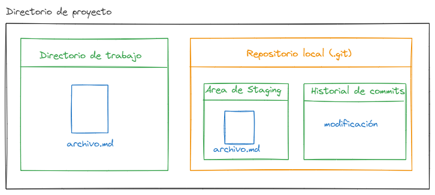
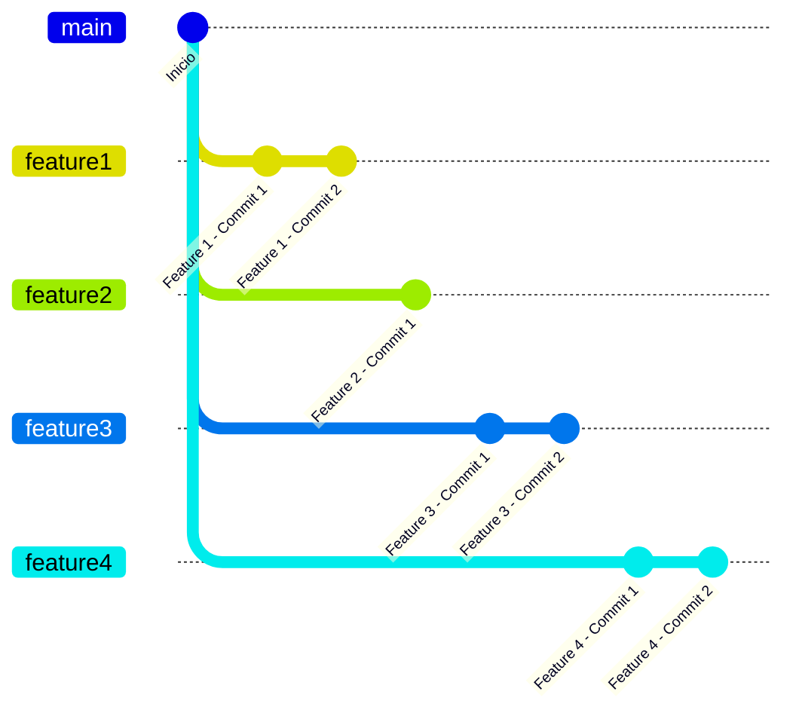
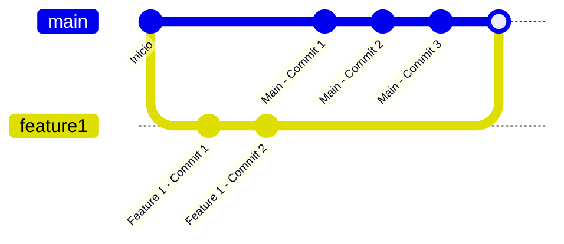

# Capítulo 2

## Ramas (Branches)

En el capítulo anterior aprendimos a crear un repositorio, a hacer un commit y a ver el historial de los commits. En este capítulo aprenderemos a trabajar con ramas y por qué son tan importantes en Git. Además, veremos cómo podemos crear, eliminar y fusionar ramas.

## Estado de un repositorio local

A continuación se muestra las 4 áreas de trabajo de un repositorio local en Git a través de un diagrama:


<p style="text-align: center; font-size:12px; font-family: sans-serif; position:relative; top:-24px; font-style:italic; font-weight: 100; opacity:80%">Diagrama de estado de un repositorio</p>

## Por qué usar ramas

Las ramas son una característica fundamental de Git. Nos permiten trabajar en diferentes funcionalidades de un proyecto de forma aislada, sin afectar el código de la rama principal (master). Esto es muy útil cuando queremos desarrollar una nueva funcionalidad o arreglar un bug sin afectar el código que ya está en producción.

Existen dos grandes razones por las que deberíamos usar ramas en Git:

- Trabajar en el mismo proyecto de diferentes maneras.
- Ayuda a que muchas personas trabajen en un mismo proyecto sin afectar el trabajo de los demás.

Puedes pensar en una rama como una línea de desarrollo. Un proyecto en Git puede tener múltiples ramas (o líneas de desarrollo). Cada una de estas ramas es una versión independiente del proyecto. Diferentes proyectos en Git pueden usar ramas de diferentes maneras, dependiendo de las necesidades de las personas que trabajan en el proyecto.

Un patrón común para trabajar con ramas es tener una línea principal oficial de desarrollo (la rama principal o primaria) y a partir de ahí crear ramas secundarias, llamadas ramas temáticas o ramas de características, que se utilizan para trabajar solo en una parte específica de el proyecto. Estas ramas temáticas son de corta duración; en última instancia, se combinan o incorporan nuevamente a la rama principal y luego se eliminan. Los dos procesos que puede utilizar para integrar una rama en otra se denominan fusión y rebase.




Como se puede observar en el diagrama anterior, se crean diferentes ramas a partir de la rama principal (main) para trabajar en diferentes funcionalidades del proyecto. Cada rama tiene su propio historial de commits y se pueden fusionar con la rama principal una vez que la funcionalidad está completa.

## Crear una rama

Para crear una rama en Git, utilizamos el comando `git branch` seguido del nombre de la rama que queremos crear. Por ejemplo, si queremos crear una rama llamada `feature1`, ejecutamos el siguiente comando:

```bash
git branch feature1
```

Para ver todas las ramas de un repositorio, podemos utilizar el comando `git branch` sin argumentos:

```bash
git branch
```

Este comando mostrará todas las ramas del repositorio y resaltará la rama actual con un asterisco (`*`). Para cambiar a una rama diferente, utilizamos el comando `git checkout` seguido del nombre de la rama:

```bash
git checkout feature1
```

Este comando cambiará el HEAD (puntero de la rama actual) al último commit de la rama `feature1`. Ahora podemos hacer cambios en esta rama sin afectar la rama principal.


## Fusionar ramas (Merge)

Una vez que hemos terminado de trabajar en una rama y queremos incorporar los cambios en la rama principal, podemos fusionar la rama con la rama principal. Para hacer esto, primero debemos cambiar a la rama principal y luego ejecutar el comando `git merge` seguido del nombre de la rama que queremos fusionar. Por ejemplo, si queremos fusionar la rama `feature1` con la rama principal, ejecutamos los siguientes comandos:

```bash
git checkout main
git merge feature1
```

Esto fusionará la rama `feature1` con la rama principal y creará un nuevo commit con los cambios de la rama `feature1`. Si hay conflictos entre los cambios de la rama `feature1` y la rama principal, Git mostrará un mensaje de error y nos pedirá que resolvamos los conflictos manualmente.



## Eliminar una rama

Una vez que hemos fusionado una rama con la rama principal y ya no la necesitamos, podemos eliminarla utilizando el comando `git branch -d` seguido del nombre de la rama. Por ejemplo, si queremos eliminar la rama `feature1`, ejecutamos el siguiente comando:

```bash
git branch -d feature1
```

Esto eliminará la rama `feature1` del repositorio. Si la rama que queremos eliminar tiene cambios que no se han fusionado con la rama principal, Git mostrará un mensaje de error y nos pedirá que confirmemos si queremos eliminar la rama de todos modos.


## Conflictos de fusión (Merge conflicts)

Los conflictos de fusión ocurren cuando Git no puede fusionar dos ramas automáticamente porque los cambios en una rama entran en conflicto con los cambios en la otra rama. Por ejemplo, si dos ramas modifican la misma línea de código de manera diferente, Git no puede decidir automáticamente cuál es la versión correcta y nos pedirá que resolvamos el conflicto manualmente.

Cuando ocurre un conflicto de fusión, Git mostrará un mensaje de error y nos indicará en qué archivos se produjo el conflicto. Para resolver el conflicto, debemos abrir los archivos en conflicto en un editor de texto y decidir qué cambios queremos mantener. Una vez que hayamos resuelto todos los conflictos, debemos agregar los archivos modificados al área de preparación y hacer un commit para finalizar la fusión.

```bash
git add <archivo>
git commit -m "Resuelto conflicto de fusión"
```

Es importante resolver los conflictos de fusión de manera cuidadosa para asegurarnos de que el código resultante sea correcto y funcione como se espera.


Si observamos el diagrama anterior, podemos ver que la rama `feature1` se fusiona con la rama principal (`main`) y se crea un nuevo commit con los cambios de la rama `feature1`. Sin embargo, luego de creada la rama `feature1`, se realizaron cambios en la rama principal que entran en conflicto con los cambios de la rama `feature1`. Para resolver este conflicto, debemos abrir los archivos en conflicto en un editor de texto y decidir qué cambios queremos mantener.


## Partes de un conflicto de fusión

Un conflicto de fusión en Git consta de tres partes:

- La versión original del archivo antes de los cambios en ambas ramas.
- La versión del archivo con los cambios de la rama actual.
- La versión del archivo con los cambios de la rama que estamos fusionando.

Para resolver un conflicto de fusión, debemos abrir el archivo en conflicto en un editor de texto y decidir qué cambios queremos mantener. Podemos editar el archivo directamente para resolver el conflicto o utilizar una herramienta de resolución de conflictos para ayudarnos a decidir qué cambios mantener.

Veremos en nuestro editor de texto algo similar a esto:

```bash
<<<<<<< HEAD (Cambio actual)
Línea de código en la rama principal
=======
Línea de código en la rama que estamos fusionando
>>>>>>> feature1 (Cambio entrante)
```

En este ejemplo, las líneas entre `<<<<<<< HEAD` y `=======` son los cambios en la rama principal, y las líneas entre `=======` y `>>>>>>> feature1` son los cambios en la rama que estamos fusionando. Debemos decidir qué cambios queremos mantener y eliminar las marcas de conflicto (`<<<<<<<`, `=======`, `>>>>>>>`) para resolver el conflicto.

<div style="background-color:black; color:white; width:70px; text-align:center;padding:4px; font-size:20px; font-family: sans-serif">Nota:</div>
Al código de la rama en la que estoy parado se le llama "Cambio entrante" y al código de la rama que estoy fusionando se le llama "Cambio entrante".


## Explorando el historial de commits con Graph Options

En Git, podemos explorar el historial de commits de un repositorio utilizando el comando `git log`. Este comando muestra una lista de todos los commits en el repositorio, junto con información sobre el autor, la fecha y la hora del commit, y el mensaje del commit.

```bash
git log
```

Sin embargo, la salida de `git log` puede ser difícil de leer, especialmente en repositorios con muchos commits. Para facilitar la visualización del historial de commits, podemos utilizar la opción `--graph` de `git log`. Esta opción muestra un gráfico ASCII que representa la estructura del historial de commits, incluidas las ramas y las fusiones.

```bash
git log --graph
```

El gráfico ASCII muestra las ramas como líneas paralelas y los commits como puntos en las líneas. Las fusiones se representan como puntos donde las líneas de las ramas se unen. Esto nos permite visualizar rápidamente la estructura del historial de commits y ver cómo las ramas se han fusionado a lo largo del tiempo.

```bash
*   commit 3 (HEAD -> main)
|\
| * commit 2 (feature1)
|/
* commit 1
```

En el ejemplo anterior, podemos ver que la rama `feature1` se fusionó con la rama principal (`main`) en el commit 3. La rama principal (`main`) ahora apunta al commit 3, que es el último commit en la rama principal.


Una solución más moderna es usar la interfaz de VSCode para ver el historial de commits.


## Git Flow

En mi experiencia en la industria, he aplicado una modalidad de trabajo llamada `Git Flow` que es una forma de trabajar con ramas en Git. En esta modalidad, se crean dos ramas principales: `master` y `develop`. La rama `master` contiene el código que se encuentra en producción y la rama `develop` contiene el código que se encuentra en desarrollo. A partir de la rama `develop` se crean nuevas ramas para trabajar en nuevas funcionalidades del proyecto. Una vez que los cambios estén listos, se integran a la rama `develop` y posteriormente a la rama `master`.


Como se puede apreciar en este gráfico, el flujo de trabajo de Git con ramas es muy flexible y permite trabajar de forma colaborativa en un proyecto.

**Rama Main (Master)**: Es la rama principal del proyecto. Contiene el código que se encuentra en producción.

**Rama Develop**: Es la rama que contiene el código que se encuentra en desarrollo. A partir de esta rama se crean nuevas ramas para trabajar en nuevas funcionalidades del proyecto.

**Features**: Son las ramas que se crean a partir de la rama `develop` para trabajar en nuevas funcionalidades del proyecto. Se integran a la rama `develop` una vez que los cambios estén listos.

En un grupo de trabajo, cada miembro puede crear una rama a partir de la rama `develop` para trabajar en una nueva funcionalidad del proyecto. Una vez que los cambios estén listos, se integran a la rama `develop` y posteriormente a la rama `master`. Veremos esta dinámica más adelante en el taller.

## Repositorios remotos

Los repositorios remotos son aquellos que se encuentran en un servidor remoto. En estos repositorios es donde se almacena el código de un proyecto y se trabaja de forma colaborativa. Existen muchos servicios que ofrecen repositorios remotos, como GitHub, GitLab, Bitbucket, entre otros. De acuerdo a mi experiencia, he trabajado con estos tres servicios y me han parecido muy buenos, sin embargo abordaremos el uso de GitHub debido a que hoy en día es el más popular y el que más se utiliza en la industria.

### Crear un repositorio remoto

Para crear un repositorio remoto en GitHub, es necesario seguir los siguientes pasos:

1. Crear una cuenta en GitHub.
2. Crear un nuevo repositorio.
3. Usar la bateria de comandos que GitHub nos proporciona para subir nuestro repositorio local a GitHub.

